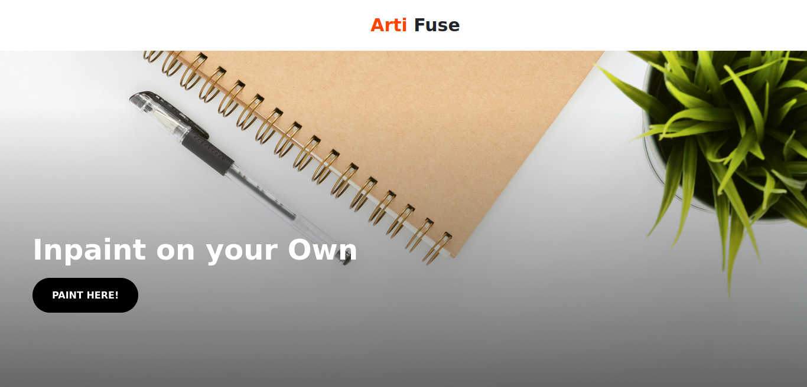
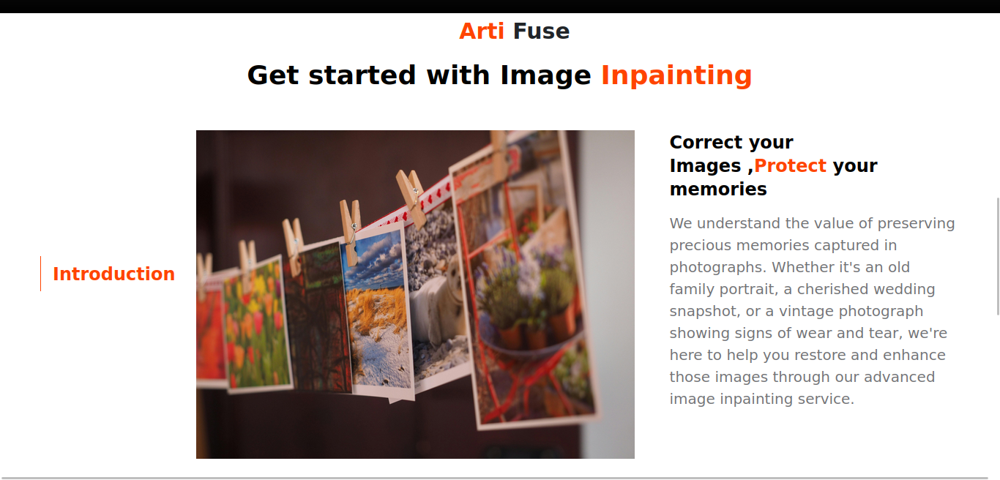
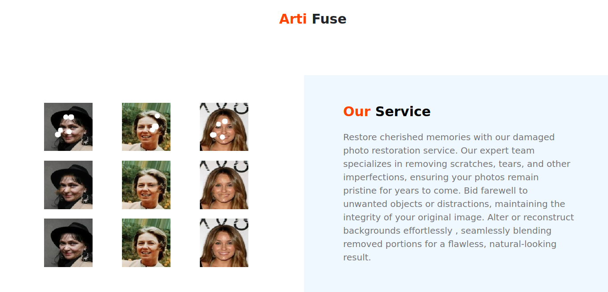
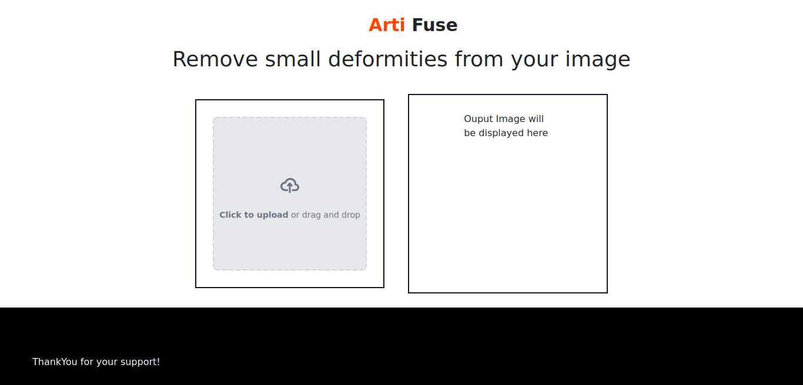
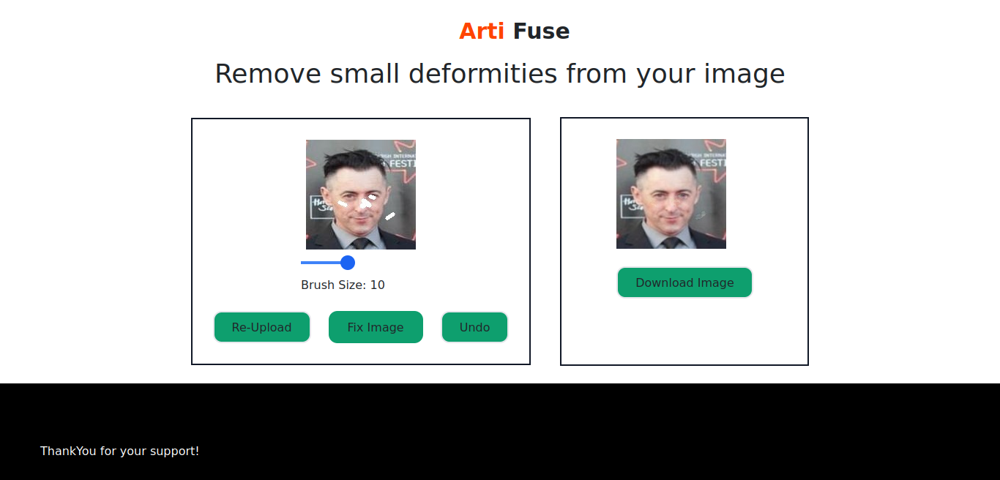

# Image Inpainting

## Description

We understand the value of preserving precious memories captured in photographs. Whether it's an old family portrait, a cherished wedding snapshot, or a vintage photograph showing signs of wear and tear, we're here to help you restore and enhance those images through our advanced image inpainting service.

Restore you images by removing scratches, tears, and other imperfections, ensuring your photos remain pristine for years to come. Bid farewell to unwanted objects or distractions, maintaining the integrity of your original image. Alter or reconstruct backgrounds effortlessly, seamlessly blending removed portions for a flawless, natural-looking result.

## Screenshots








## Table of Contents

- [Features](#features)
- [Demo](#demo)
- [Installation](#installation)
- [License](#license)

## Features

Helps remove small deformities present in you image.

## Demo

[Demo Link](https://github.com/SauravKumarMahato/ScriptQuin/assets/83631265)

## Installation

1. Clone the repository:

```bash
git@github.com:SauravKumarMahato/ScriptQuin.gitMinor_ArtiFuse
```

2. Install requirements.txt (required in backend, using venv any other)
```bash
pip install -r requirements.txt
```

3. Navigate to frontend folder 
```bash
yarn install 
```

4. Run frontend
```bash 
yarn run dev 
```

5. Open another terminal and run below in it. 
```bash 
cd api
python app.py 
```

6. Open browser and navigate to 
```bash 
http://localhost:5173/
```
#### Note: Since the inpainting model has size greater than 100MB permitted by Github to push so, it hasn't been uploaded. Contact the owner for futher details on it.


## License
This project is licensed under the MIT License.